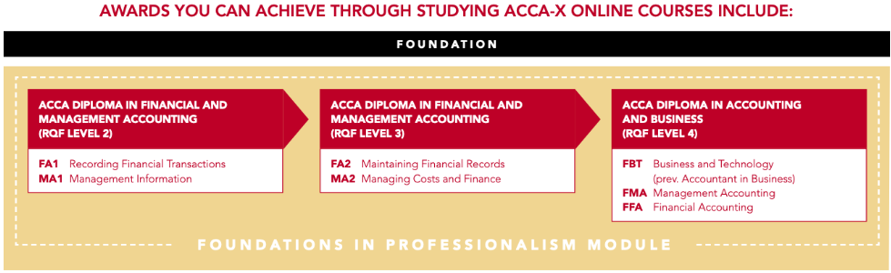

# Introduction to Book Keeping: Course Orientation: Lesson 2 - Getting your Diploma

* Unit 1: Qualifications Available
* Unit 2: ACCA Qualification

## Unit 1: Qualifications Available

Studying with ACCA-X allows you to gain recognised qualifications on your journey. This diagram illustrates what qualifications are possible:

Before you sit any exams you will need to register as an [ACCA student](https://www.accaglobal.com/acca-registration-intro.html). More on this in the next unit.

Below is some information on the length and structure of the ACCA Recording Financial Transactions (FA1) exam. However, we also recommend reading through the Recording Financial Transactions syllabus and exam diagram resources available on the right-hand side of your course homepage. These provide key information and guidance on how to plan for exam success.

### The Exam

* Available as an on demand computer based exam
* Two hours long
* 50 multiple choice questions
* Each question is worth 2 marks (100 marks available in total)
* The pass mark is 50%

When you take the ACCA exam it will be timed and you can’t look at notes or ask anybody else for the answers.

## Unit 2: ACCA Qualification

### Why ACCA?

A career in accountancy gives you the chance to work in a variety of jobs in different industries, with good pay and career prospects. ACCA has over 100 years of experience and a proven reputation for quality and excellence.

Watch the video below to learn more about ACCA.

### Video 1

Transcript:

* When I say **accountancy**, you think of the numbers, but it's much more than that. To change things for the better, drive prosperity and create opportunity,
who can make the numbers do all that. 
* We're **leaders**, ACCA accountants understand teamwork and know how to maximise opportunities. We're essential partners in getting businesses to achieve their goals.
* We're **communicators**, able to imagine and inspire. If all the world's a stage, you
must be able to speak on it.
* We're **pioneers** who test boundaries and push frontiers. We challenge people to think ahead and make ethical choices. We love sustainable solutions to today's problems. The future is ours to protect and nurture. 
* We're **digital**. We harness the power of technology to innovate and push
boundaries and be a positive force for good.
* We're **artists** applying original solutions to real-world problems. When misfortune strikes, it's not just money that's needed to rebuild, but an
energetic mind and original voice to overcome the odds. 
* We're **ambitious**. Our accountants know no boundaries and harness the power of diverse cultures to seek out international opportunities. 
* **Accounting is the global language of business** and being fluent can take you anywhere. 
* So when I say **accountancy**, sure think of the numbers: the number of lives changed, systems improved, business successes, environments saved. 
* Studying to become an **ACCA finance professional** means to future-proof your passions, your skills, your life. For the opportunities of a brighter tomorrow.

So, what do you want to achieve? Use the interactive flowchart below to see how we can help you succeed.

I am ...

* **An ACCA Student**: 
Great, you’ve already registered with ACCA, so you’re ready to get the most out of the course – including the certificate! Register for the exam when you feel you are ready.

* **Working as an accountant but not registered with ACCA**: 
Qualified accountants go further in their careers. To make sure you can progress in your career, register as an ACCA student to gain a well-respected accounting qualification.

* **Trying to start a career in accounting**
This is a great start! Employers may want to see evidence of your knowledge. Do you want to get a certificate?

  * **Yes**
To get a certificate you need to pass the ACCA FA1 exam. Register as an ACCA Student to register for exams.
  * **No**
Complete the orientation section so that you get the most out of the course and enjoy learning about accounting!

* **Interested in gaining general knowledge in accounting, but I don’t want to do it as a career.**
You’re in the right place! You might also be interested in our free courses – go to [acca-x.com](acca-x.com) for more information.

### Register with ACCA

[Register as an ACCA student here](http://www.accaglobal.com/ubcs/en/qualifications/apply-now.html). This will give you access to a myACCA account, which will:

* Give you access to more support in your accounting studies
* Allow you to register for exams
* Access the tools for recording any practical experience gained whilst studying with ACCA
* Get more practice tests.

You can download the free [ACCA Student Accountant app](https://www.accaglobal.com/uk/en/student/getting-started/accounting-apps-for-students.html) and personalise it to get study support that is tailored for your studies.

> **Useful Information**: Interested in ACCA and a career in accountancy? [Join our mailing list](https://yourfuture.accaglobal.com/global/en/contact/keep-in-touch.html) for career advice and industry news.
