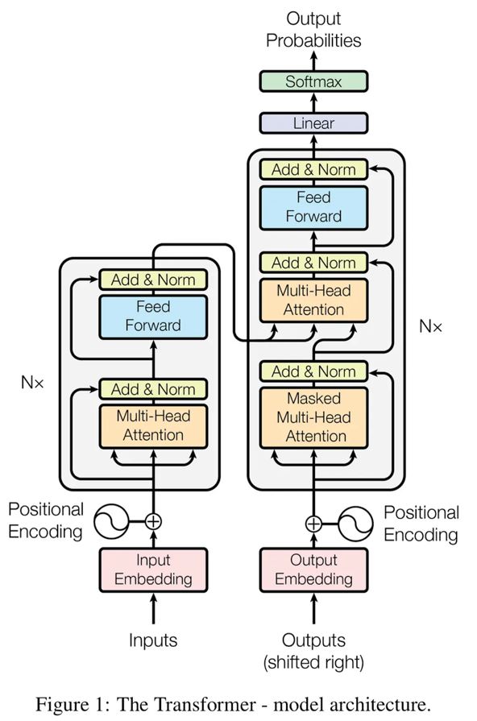

# Fine Tuning for LLMs

## Introduction to Large Lanaguage Models (LLMs)

### 📘 LLMs: Revolutionizing AI — Key Bullet Points (Revision)

* LLMs (Large Language Models) enable **human-like text understanding and generation**
* Core technology behind **modern AI systems and assistants**
* Make interactions with machines **more natural and accessible**

#### 🔹 Where LLMs Are Used

* Power:
  * Virtual assistants (e.g., Siri, Alexa)  
  * Customer support chatbots  

* Work behind the scenes to:
  * Improve user experience  
  * Automate communication  

#### 🔹 Impact Across Industries

* **Healthcare**
  * Faster diagnostics  
  * Personalized treatment support  

* **Education**
  * 24/7 personalized tutoring  
  * Adapts to individual learning styles  

* **Business**
  * Automates emails and reports  
  * Improves communication efficiency  

* **Creative Fields**
  * Assist in art and music creation  
  * Enable new creative possibilities  

#### 🔹 Key Advantages

* Always available (**24/7 support**)  
* Learns and improves from data  
* Handles repetitive + complex tasks efficiently  

#### 🔹 Core Insight

* LLMs act like:
  * **“AI assistants that never sleep”**
  * Systems that continuously **learn and improve outputs**

#### 🧠 Quick Recall - LLM Impact

* LLMs = human-like language AI  
* Used in healthcare, education, business, creativity  
* Key benefit → efficiency + personalization + automation  

---

### 📘 LLM Architecture — Key Bullet Points (Revision)

* Modern LLMs are built on **Transformer architecture** (introduced by Google, 2017)
* Transformers are the **foundation of most advanced language models**

#### 🔹 Core Components

* **Encoders**
  * Process and understand input text  
  * Extract context and meaning  

* **Decoders**
  * Generate output text  
  * Use encoded information to form responses  

👉 Big Picture:

* Encoder = understand  
* Decoder = generate  

#### 🔹 Key Innovation: Self-Attention

* Enables model to:
  * Identify **important words relative to others**
  * Capture **relationships across entire sentence**

* Helps connect:
  * Words that are far apart but contextually related  

👉 Benefit:

* Strong **context awareness and nuance understanding**

#### 🔹 Transformer vs Older Models

* **Transformers**
  * Process data **in parallel**
  * Faster and scalable  

* **RNNs / LSTMs**
  * Process data **sequentially**
  * Slower and limited context handling  

#### 🔹 Layered Architecture

* Built using **multiple stacked layers**
* Each layer:
  * Acts like a **mini decision unit**
  * Focuses on different text patterns  

👉 Outcome:

* Improved **language understanding + generation quality**

#### 🔹 Capabilities Enabled

* Translation  
* Content generation  
* Text understanding  
* Pattern recognition at scale  

#### 🧠 Quick Recall - LLM Architecture

* Transformer = core of LLMs  
* Encoder → input understanding  
* Decoder → output generation  
* Self-attention → context linking  
* Parallel processing → speed  
* Layers → deeper intelligence  

---

