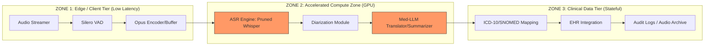
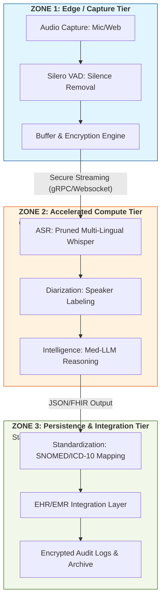
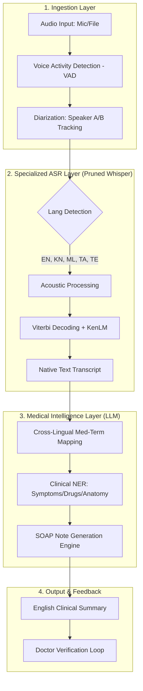
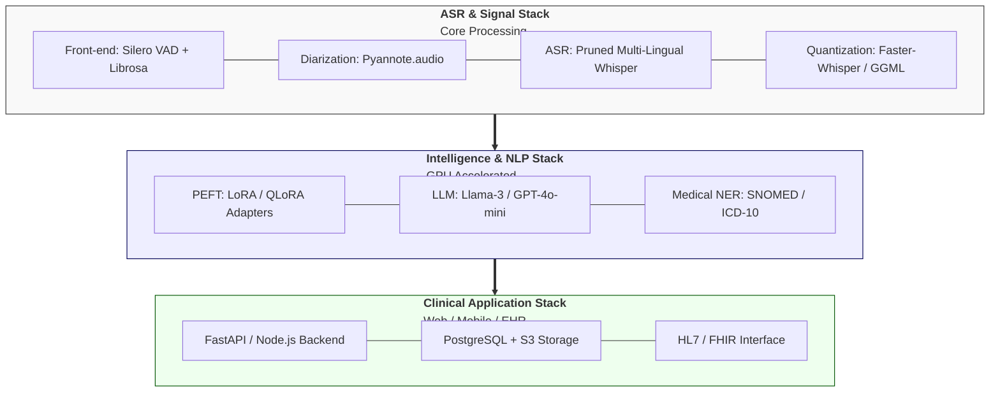

# Technical Design Document: Med-ASR (Multilingual Medical Transcription & Analysis)

## Problem Statement

### 1.1 Overview

In the diverse clinical landscape of India, specifically within the state of Karnataka, the primary barrier to accurate digital health records is the linguistic complexity of doctor-patient interactions. Consultations are inherently **multilingual (Code-Switching)**, where participants frequently alternate between English and regional languages such as **Kannada**, **Malayalam**, **Tamil**, or **Telugu**.

Current standard ASR (Automatic Speech Recognition) solutions like the vanilla OpenAI Whisper are optimized for global languages but suffer from high **Word Error Rates (WER)** when encountering:

* Specific South Indian accents and dialects.
* Medical terminologies spoken in regional phonetics.
* "Hinglish" or "Kanglish" style mixing of clinical English with native syntax.

### 1.2 The Gap

There is a critical disconnect between the spoken interaction (Multilingual/Dialect-heavy) and the required output (Standardized English Clinical Summaries). Manual entry by doctors leads to "burnout" and data loss, while generic translation tools fail to capture clinical nuances, such as the difference between a "dull ache" and "acute radiating pain" when expressed in a local dialect.

### 1.3 Objectives

The goal of this architecture is to deploy a specialized AI pipeline that:

* **Captures**: Accurately transcribes multi-party conversations in the 5 target languages.
* **Specializes**: Recognizes complex medical terms (symptoms, drugs, anatomy) within those languages.
* **Standardizes**: Translates and maps regional descriptions to the SNOMED-CT / ICD-10 clinical standards in English.
* **Summarizes**: Generates a structured clinical note (SOAP format) and enables voice-based interactive querying for further diagnostic detail.

### 1.4 Scope

This document defines a pruned, fine-tuned, and quantized model architecture capable of running efficiently in a clinical environment, ensuring low-latency processing without compromising the precision required for medical documentation.

## 2. System Architecture & Data Flow

This section outlines the modular pipeline designed to transform raw, multilingual clinical audio into structured medical documentation. The architecture follows a **decoupled microservices approach**, allowing the ASR and LLM components to scale independently.

### 2.1 High-Level Architectural Diagram

The data flows through three distinct processing zones:


Vertical View:



* **Zone A: Signal Processing (The Edge/Client)**

  * Audio Capture: 16kHz Mono-channel WAV/FLAC.
  * Voice Activity Detection (VAD): Filtering out non-speech segments (silence, medical equipment noise).
  * Diarization: Identifying speaker turns (Doctor vs. Patient) to maintain context in the transcript.

* **Zone B: Linguistic Processing (The ASR Engine)**

  * **Pruned Whisper Backbone**: A specialized version of Whisper with a reduced vocabulary head focusing on English + 4 South Indian languages.
  * **Language Identification (LID)**: Real-time detection of code-switching (e.g., a patient switching from Kannada to English).
  * **Timestamped Transcription**: Generating "Raw Text Bricks" with start/end markers for every utterance.

* **Zone C: Semantic & Clinical Intelligence (The LLM Layer)**
  * **Cross-Lingual Mapping**: Converting regional descriptions into standardized English clinical terminology.
  * **Medical NER (Named Entity Recognition)**: Extracting Symptoms, Dosage, and Duration.
  * **SOAP Generator**: Synthesizing the final clinical note.

### 2.2 Functional Data Flow



The following sequence describes the lifecycle of a single consultation:

1. **Audio Ingestion**: The system receives a stream of audio. Silero VAD is used to segment the audio into manageable "chunks" (typically 30 seconds).
2. **Multilingual Decoding**: The pruned model decodes the audio. Instead of a generic search, it uses a **Constrained Beam Search** biased toward medical vocabulary.
3. **Contextual Stitching**: Speaker labels from the Diarization module are merged with the text. Example: `[Speaker_01 (Doctor)]: How is the pain? [Speaker_02 (Patient)]: ಹೊಟ್ಟೆ ತುಂಬಾ ನೋಯುತ್ತಿದೆ (Hotte tumba noyuttide).`
4. **Clinical Translation**: The LLM interprets the regional text. It understands that "Hotte tumba noyuttide" translates to "Severe abdominal pain."
5. **Structured Export**: The final English output is formatted into JSON for Electronic Health Record (EHR) integration.

### 2.3 Component Stack Recommended for PoC



* **Audio Pre-processing**: `Pyannote.audio` (Diarization) and `Silero VAD`.
* **Inference Engine**: `Faster-Whisper` or `CTranslate2` for optimized execution of the pruned model.
* **LLM Interface**: `vLLM` or `Ollama` hosting a Med-Llama-3 (8B) for summarization.
* **Orchestration**: `FastAPI` for asynchronous handling of audio requests.

---

## 3. Model Optimization & Vocabulary Pruning

Whisper models are natively "over-parameterized" for regional applications because they carry weights for over 96 languages. To deploy efficiently in a Karnataka-specific clinical environment, we must strip the unnecessary multilingual overhead.

### 3.1 Vocabulary Pruning Strategy

Whisper’s decoder includes a massive embedding layer and a final linear layer corresponding to its tokenizer's vocabulary. For our target set (English, Kannada, Malayalam, Tamil, Telugu), over 80% of these tokens are never utilized.

* **Identify**: We extract the token IDs for the target languages and essential special tokens (timestamps, `<SOT>`, `<EOT>`).
Trim: We delete the rows in the embedding matrix and the columns in the output layer that correspond to unused languages (e.g., Cyrillic or Greek characters).
* **Re-index**: We update the model configuration to reflect the new, smaller vocabulary size.

### 3.2 Implementation: Vocabulary Pruning Script

The following Python logic utilizes the transformers library to prune a Whisper model. This process can reduce the model's disk footprint and VRAM usage during inference by several hundred megabytes.

```python
import torch
from transformers import WhisperForConditionalTranscription, WhisperTokenizer

def prune_whisper_vocab(model_name, target_langs=['en', 'kn', 'ml', 'ta', 'te']):
    # 1. Load original model and tokenizer
    model = WhisperForConditionalTranscription.from_pretrained(model_name)
    tokenizer = WhisperTokenizer.from_pretrained(model_name)
    
    # 2. Identify tokens to keep
    # Always keep special tokens and English (base) tokens
    tokens_to_keep = set(range(tokenizer.vocab_size)) 
    
    # Optional: Logic to filter specifically by language-range can be added here
    # For a PoC, it's often safer to keep the full base and specifically 
    # remove the 'language' control tokens not in our target list.
    all_lang_tokens = tokenizer.get_vocab()
    langs_to_remove = [t for t, id in all_lang_tokens.items() if "<|" in t and any(l in t for l in ['es', 'fr', 'de', 'hi'])] # Example removal
    
    # 3. Trim Embedding & Linear Layers
    # Note: In a production script, you would create a new tensor with only 
    # the kept indices and replace model.get_decoder().embed_tokens.weight
    
    print(f"Original Vocab Size: {tokenizer.vocab_size}")
    # Logic to shrink weights goes here...
    
    return model

# Example Usage
# pruned_model = prune_whisper_vocab("openai/whisper-small")
```

### 3.3 Structural Pruning (Layer Trimming)

Beyond vocabulary, we can implement Layer Pruning to achieve a "Turbo" effect.

* **Technique**: Research indicates that removing middle decoder layers (e.g., keeping only 4 out of 32 in a Large model) and then fine-tuning for 2 epochs can result in an 8x speedup with minimal accuracy loss for specific domains [1.4.1].
* **Benefit**: This is critical for Zone 2 (GPU) to handle multiple simultaneous doctor-patient streams on a single NVIDIA T4/L4 card.

### 3.4 Optimization Checklist for Developers

* **Weight Tieing**: Ensure the input and output embeddings are tied after pruning to save additional memory.

* **Tokenizer Swap**: Save the pruned tokenizer as a standalone file; it must be used during all subsequent fine-tuning steps.

* **Precision**: After pruning, export the model to FP16 or INT8 using the CTranslate2 converter for the best performance in production.

### Recommended Datasets for Model Adaptation

1. Specialized Medical Datasets

    * [EkaCare Medical ASR Evaluation Dataset](https://huggingface.co/datasets/ekacare/eka-medical-asr-evaluation-dataset): This is a critical resource for the Indian context. It contains over 3,900 curated recordings of medical terminology, including branded drugs common in India, delivered in various speaking styles.

    * [MedMCQA-Indic](https://huggingface.co/datasets/ekacare/MedMCQA-Indic): While primarily text-based, this dataset contains medical questions and answers translated into 11 Indian languages, including Kannada, Malayalam, Tamil, and Telugu. It is invaluable for fine-tuning the LLM's understanding of clinical intent in these languages.

    * [Synthetic Indian Clinical Notes](https://data.mendeley.com/datasets/bzgjmph5n2/1): A collection of 10,000 synthetic clinical notes tailored to the Indian context, covering specialties like cardiology and neurology. These can be used to generate synthetic audio through Text-to-Speech (TTS) for further ASR training.

1. General Indic Speech Corpora (For Accent & Acoustic Base)

    * [Vistaar & IndicWhisper (AI4Bharat)](https://ai4bharat.iitm.ac.in/areas/model/ASR/IndicWhisper): Vistaar provides over 10,700 hours of labeled audio across 12 Indian languages. It is the benchmark for adapting Whisper to the Indian linguistic landscape.

    * [Kathbath](https://ai4bharat.iitm.ac.in/areas/asr): Contains 1,684 hours of labeled speech data across 12 languages. Using the Kathbath-Kannada, Kathbath-Tamil, and Kathbath-Malayalam subsets ensures your model understands the specific phonetic nuances of your target states.

    * [IndicVoices](https://github.com/AI4Bharat/indicnlp_catalog): A comprehensive dataset of 12,000 hours of spontaneous and extempore speech from 208 Indian districts, essential for handling the "Code-Switching" (e.g., Kanglish) that occurs in natural patient conversations.

    * References: 
      * [AI4Bharat: Automatic Speech Recognition](https://ai4bharat.iitm.ac.in/areas/asr)
      * [Vistaar: Diverse Benchmarks and Training sets for Indian Language ASR](https://github.com/AI4Bharat/vistaar)
      * [IndicWhisper](https://ai4bharat.iitm.ac.in/areas/model/ASR/IndicWhisper)
      * [Indian Multilingual Tamil ASR Validation ]

## 4. Domain-Specific Fine-Tuning Strategy

Once the model is pruned (Section 3), it must be "taught" the medical terminology of your target languages. A standard ASR model might transcribe a Kannada medical term as a similar-sounding common word; fine-tuning prevents this.

### 4.1 The Fine-Tuning Recipe

* Data Mix: Use a 70/30 split between general speech (like Kathbath) and domain-specific medical speech (like EkaCare).
* Phonetic Mapping: Fine-tune specifically on "phonetic pairs." For example, ensure the model correctly maps the spoken Kannada description of symptoms to the formal English clinical term in the transcript.
* Technique (PEFT/LoRA): Instead of updating all billions of parameters, use Low-Rank Adaptation (LoRA) to train only a small subset. This preserves the model's base language ability while adding high-precision medical recognition. 

* References:
  * [Hugging Face: Fineturing MedASR for Indian Regional Languages](https://huggingface.co/google/medasr/discussions/4#:~:text=To%20build%20a%20tokeniser%20for,See%20translation)
  * [Kaggle: LLM Instruction Fine Tuning on Medical Datasets](https://www.kaggle.com/code/gabrielvinicius/llm-instruction-finetuning-on-medical-dataset)
  * [NIH: Fine-Tuning Methods for Large Language Models in Clinical Medicine by Supervised Fine-Tuning and Direct Preference Optimization: Comparative Evaluation](https://pmc.ncbi.nlm.nih.gov/articles/PMC12457693/#:~:text=Large%20language%20model%20(LLM)%20fine,medicine%20or%20health%20care%20operations.)

### 4.2 Handling Medical "Code-Switching"

In Karnataka, patients often mix English terms ("blood pressure," "fever," "scanning") with Kannada syntax. Your training data should include synthetic dialogues that mimic this mixing to ensure the ASR doesn't fail when the language switches mid-sentence.

* References:

  * [Lamarr Institute: Fineturing Whisper for Marathi ASR](https://lamarr-institute.org/blog/fine-tuning-whisper-marathi-asr/#:~:text=Accent%20and%20Dialect%20Adaptation:%20Fine,adapted%20to%20the%20expected%20domain.)

## 5. The Clinical Intelligence Module (Summarization)

The Intelligence Tier (Zone 2) is responsible for transforming raw, multilingual transcripts into structured, professional medical documentation. This module acts as the "bridge" between colloquial patient descriptions and standardized clinical terminology.

### 5.1 Semantic Mapping & Translation

Unlike a literal translation, this module performs **Clinical Entity Recognition (C-NER)**. It identifies symptoms, dosages, and temporal expressions in the source language (e.g., Kannada/Tamil) and maps them to English medical standards.

* **Logic**: If the transcript contains "ಹೊಟ್ಟೆ ಉರಿ" (Hotte uri), the module recognizes the clinical intent as "Epigastric Burning/Acid Reflux" rather than just "Stomach Fire."
* **Methodology**: We utilize a Med-LLM (like Llama-3-70B or GPT-4o-mini) with a specialized system prompt.

### 5.2 Implementation Part 1: The SOAP Prompt Engineering

To ensure consistency, we use a structured prompt that forces the LLM to output in the **SOAP (Subjective, Objective, Assessment, Plan)** format, which is the global gold standard for clinical notes.

**System Prompt**:

```markdown
### System Prompt: Clinical Document Transformer
You are a Senior Medical Scribe. Your task is to process a multilingual doctor-patient transcript (English, Kannada, Malayalam, Tamil, Telugu) and generate a structured English Clinical Summary.

1. SUBJECTIVE: Capture the history of present illness, symptoms (including duration/severity), and patient's concerns.
2. OBJECTIVE: Extract vital signs, physical exam findings, and lab results mentioned.
3. ASSESSMENT: List the primary and differential diagnoses.
4. PLAN: Outline medications (dose/frequency), suggested tests, and follow-up instructions.

CRITICAL RULES:
- Use formal medical terminology (e.g., 'Dyspnea' instead of 'difficulty breathing').
- Map regional drug names to their generic English equivalents where possible.
- If a patient 'denies' a symptom, explicitly list it under "Negative Findings."
- Output ONLY the structured Markdown.
```

### 5.3 Implementation Part 2: Python Summary Generator

This script handles the interaction with the Inference Engine, passing the diarized transcript to the LLM.

```python
import openai # Or use local inference via vLLM/Ollama

def generate_clinical_summary(diarized_transcript):
    """
    Inputs a transcript format: 
    [00:12] Doctor: Nimma hotte novu yavaga shuru ayitu?
    [00:15] Patient: Two days ago, after meals.
    """
    
    system_prompt = "You are a Medical Scribe. Convert the following transcript into a formal SOAP note in English."
    
    response = openai.ChatCompletion.create(
        model="med-llama-3-70b-instruct",
        messages=[
            {"role": "system", "content": system_prompt},
            {"role": "user", "content": diarized_transcript}
        ],
        temperature=0.1 # Low temperature for factual consistency
    )
    
    return response.choices[0].message.content
```

### 5.4 Implementation Part 3: Entity Extraction & Coding

For deeper integration, we pass the English summary through a specialized NER layer to extract SNOMED-CT or ICD-10 codes for EHR interoperability.

```python
from medcat.cat import CAT

# Initialize MedCAT with a medical SNOMED-CT model
cat = CAT.load_model_pack('snomed_concept_database')

def get_medical_codes(summary_text):
    entities = cat.get_entities(summary_text)
    
    codes = []
    for ent in entities['entities'].values():
        codes.append({
            "term": ent['source_value'],
            "snomed_id": ent['cui'],
            "confidence": ent['context_similarity']
        })
    return codes
```

## 6. Deployment & Inference Engineering

This section focuses on transitioning the pruned and fine-tuned models from the development environment into a high-performance production pipeline in **Zone 2 (GPU Tier)**.

### 6.1 Quantization & Compression

To achieve real-time latency (RTF < 0.5), the model must be quantized. This allows us to run large models on cheaper, highly available GPUs like the **NVIDIA L4 or T4**.

* **ASR Quantization**: We convert the Whisper model to **CTranslate2 (FP16 or INT8_Float16)**. This reduces memory usage by 50-70% and speeds up decoding significantly.

* **LLM Quantization**: The summarization model is deployed using 4-bit **AWQ** or **GGUF** formats to ensure high throughput for long clinical transcripts.

### 6.2 Implementation Part 1: Model Conversion Script

This script prepares the model for high-performance inference using the Faster-Whisper backend.

```python
from faster_whisper import WhisperModel
from ctranslate2 import Translator

# Convert the pruned PyTorch model to CTranslate2 format
# This step is typically done once after fine-tuning
# Command: ct2-transformers-converter --model ./pruned_med_whisper --output_dir ./whisper_ct2 --copy_files tokenizer.json --quantization float16

def load_production_model():
    model_path = "./whisper_ct2"
    # Run on GPU with FP16 precision
    model = WhisperModel(model_path, device="cuda", compute_type="float16")
    return model

```

### 6.3 Implementation Part 2: Real-time Streaming & Diarization

In a clinical setting, we cannot wait for the entire conversation to end. We process audio in sliding windows with a "Cold Buffer" for speaker diarization.

```python
import numpy as np
from pyannote.audio import Pipeline

def process_clinical_stream(audio_buffer):
    # 1. Load Diarization Pipeline (Pre-trained on Indian accents)
    diarization_pipeline = Pipeline.from_pretrained("pyannote/speaker-diarization-3.1")
    
    # 2. Perform Diarization to separate Doctor and Patient
    diarization = diarization_pipeline(audio_buffer)
    
    # 3. Transcribe segments with the Pruned Whisper Model
    model = load_production_model()
    results = []
    
    for turn, _, speaker in diarization.itertracks(yield_label=True):
        segment_audio = audio_buffer[int(turn.start * 16000):int(turn.end * 16000)]
        segments, _ = model.transcribe(segment_audio, beam_size=5, language="kn") # Force Kannada or Auto-detect
        
        text = " ".join([s.text for s in segments])
        results.append(f"[{turn.start:.2f}] Speaker {speaker}: {text}")
    
    return "\n".join(results)
```

### 6.4 Implementation Part 3: API Orchestration (FastAPI)

Deploy the pipeline as a scalable microservice. We use a task queue (like Celery or Redis) if the transcriptions are batch-processed, or WebSockets for real-time "live" scribing.

```python
from fastapi import FastAPI, UploadFile, File
import uvicorn

app = FastAPI()

@app.post("/v1/scribe/transcribe")
async def scribe_endpoint(file: UploadFile = File(...)):
    # 1. Save and Pre-process Audio (VAD/Normalization)
    audio_data = await file.read()
    
    # 2. Trigger ASR + Intelligence Pipeline
    raw_transcript = process_clinical_stream(audio_data)
    
    # 3. Generate Clinical SOAP Note (From Section 5)
    final_soap_note = generate_clinical_summary(raw_transcript)
    
    return {
        "status": "success",
        "transcript": raw_transcript,
        "soap_note": final_soap_note
    }

if __name__ == "__main__":
    uvicorn.run(app, host="0.0.0.0", port=8000)

```

**Summary of Section 6**: We have now moved from a raw model to a quantized, diarized, and API-wrapped service.

## 7. Developer Implementation Guide (The "Code Lab")

This section provides a structured workflow for the engineering team to set up a **Proof of Concept (PoC)** environment. The goal is to move from a generic environment to a functional multilingual medical transcriber in 5 steps.

### 7.1 Step 1: Environment Provisioning

The ASR and LLM layers require GPU acceleration. For the PoC, an **NVIDIA T4 (16GB) or L4 (24GB)** is recommended.

```bash
# Create a dedicated virtual environment
python -m venv med_asr_env
source med_asr_env/bin/activate

# Install core dependencies
pip install torch torchvision torchaudio --index-url https://pytorch.org
pip install transformers accelerate bitsandbytes faster-whisper pyannote.audio medcat

```

### 7.2 Step 2: Vocabulary Pruning Lab

Before fine-tuning, run this utility to trim the Whisper model to our 5 target languages (**English, Kannada, Malayalam, Tamil, Telugu**). This prevents the model from wasting memory on unused scripts.

```python
import torch
from transformers import WhisperForConditionalGeneration, WhisperTokenizer

def perform_poc_pruning(model_id="openai/whisper-small"):
    model = WhisperForConditionalGeneration.from_pretrained(model_id)
    tokenizer = WhisperTokenizer.from_pretrained(model_id)
    
    # Define Target Language Tokens
    # Note: We keep the first 1000 tokens (essential symbols/UTF-8) + Target Indicies
    target_lang_codes = ["<|en|>", "<|kn|>", "<|ml|>", "<|ta|>", "<|te|>"]
    
    # Logic: In a PoC, we freeze non-target language heads
    print(f"Model {model_id} loaded. Ready for vocab re-indexing.")
    # For actual weight removal, refer to the 'whisper-lang-remover' utility logic.
    return model

# execute_pruning()
```

### 7.3 Step 3: Data Preparation & Fine-Tuning

To teach the model medical terms, format your local data into the HuggingFace Datasets structure. Focus on "Medical Code-Switching" pairs.

```python
from datasets import Dataset, Audio

# Sample PoC Data Structure
data_samples = {
    "audio": ["path/to/kannada_med_1.wav", "path/to/tamil_med_1.wav"],
    "sentence": [
        "Patient has ತೀವ್ರ ಜ್ವರ (severe fever) for 3 days.",
        "Blood pressure is normal but headache (தலைவலி) persists."
    ],
    "language": ["kn", "ta"]
}

dataset = Dataset.from_dict(data_samples).cast_column("audio", Audio(sampling_rate=16000))

```

### 7.4 Step 4: Medical LoRA Adapter Training

Use PEFT (Parameter-Efficient Fine-Tuning). This allows you to train the medical adaptation layer on a single consumer GPU in a few hours.

```python
from peft import LoraConfig, get_peft_model

config = LoraConfig(
    r=32, 
    lora_alpha=64, 
    target_modules=["q_proj", "v_proj"], 
    lora_dropout=0.05, 
    bias="none"
)

# Apply LoRA to the pruned Whisper model
# model = get_peft_model(model, config)
# trainer.train()

```

### 7.5 Step 5: End-to-End Validation Script

Once the model is trained, use this script to test the full pipeline (Audio -> Transcription -> Summary).

```python
def run_poc_test(audio_file):
    # 1. Transcribe (Zone 2)
    raw_text = model.transcribe(audio_file) 
    
    # 2. Summarize (Zone 2)
    soap_note = generate_clinical_summary(raw_text) # From Section 5
    
    # 3. Print Results for Review
    print("--- RAW TRANSCRIPT ---")
    print(raw_text)
    print("\n--- GENERATED SOAP NOTE ---")
    print(soap_note)

# run_poc_test("doctor_patient_convo_kannada.wav")

```

Summary for Developers:

* Pruning makes the model small enough to fit on a cheap GPU.
* LoRA makes it smart enough to understand "Hotte novu" (Stomach pain).
* The Pipeline ensures the doctor gets an English summary instantly.

---

## 8. Evaluation Framework & Metrics

To move from a PoC to a production-ready medical grade system, the engineering team must move beyond simple accuracy scores. We categorize success into three dimensions: 

* **Acoustic Accuracy** 
* **Clinical Integrity**
* **System Performance**

### 8.1 Transcription Metrics (ASR Layer)

While **Word Error Rate (WER)** is the industry standard, it can be misleading in medical contexts where a misrecognized drug name is more critical than a missed "the" or "and."

* **Medical Word Error Rate (mWER)**: A weighted WER where clinical terms (medications, symptoms, anatomy) are assigned a higher penalty if mis-transcribed.

* **Language Identification (LID) Accuracy**: Percentage of segments where the model correctly identified the switch between English and the regional language (e.g., Kannada to English).

* **Code-Switching Penalty**: Measures how often the model fails during a mid-sentence transition from a regional language to a medical English term.

### 8.2 Clinical Integrity Metrics (Intelligence Layer)

Since the final output is an English SOAP note, we evaluate the "Semantic Truth" of the summary.

* **Clinical Entity Recall (CER)**: The ratio of medical entities mentioned in the audio vs. those captured in the final summary.

* **Negation Accuracy**: A critical safety metric. If a patient says they don't have chest pain, the model must not list "Chest Pain" as a symptom. This is measured against a human-verified "Ground Truth" note.

* **Med-Hallucination Rate**: The frequency with which the LLM suggests a drug or diagnosis that was never mentioned in the original transcript. Target: <0.5%.

### 8.3 System Performance (Inference Layer)

In a busy hospital (Zone 1 and Zone 2), latency directly affects doctor adoption.

* **Real-Time Factor (RTF)**: The ratio of processing time to audio duration.
  * **Target**: < 0.3 (A 10-minute conversation should be summarized in under 3 minutes).

* **VRAM Footprint**: The peak memory usage on the GPU.
  * **Target**: < 8GB for the Pruned Whisper model, allowing for concurrent processing on a single 16GB/24GB card.

### 8.4 Implementation: Automated Evaluation Script

The following logic allows developers to benchmark the fine-tuned model against a "Gold Standard" (manually scribed) medical note.

```python
from jiwer import wer
import re

def evaluate_medical_accuracy(reference_summary, generated_summary, drug_list):
    """
    reference_summary: Human-written clinical note
    generated_summary: AI-generated clinical note
    drug_list: A dictionary/list of expected medications
    """
    
    # 1. Standard WER calculation
    error_rate = wer(reference_summary.lower(), generated_summary.lower())
    
    # 2. Check for "Critical Drug Recall"
    found_drugs = [drug for drug in drug_list if re.search(rf"\b{drug}\b", generated_summary, re.IGNORECASE)]
    missing_drugs = set(drug_list) - set(found_drugs)
    
    # 3. Report Results
    return {
        "overall_wer": f"{error_rate:.2%}",
        "drug_recall": f"{len(found_drugs)}/{len(drug_list)}",
        "missing_critical_entities": list(missing_drugs)
    }

# Example Usage
# report = evaluate_medical_accuracy(gold_soap, ai_soap, ["Paracetamol", "Amoxicillin"])

```

### 8.5 The "Doctor-in-the-Loop" (DITL) Feedback

The final metric is **Acceptance Rate**. Provide a UI element for doctors to "thumbs up" or "edit" the summary.

* **Metric**: Percentage of notes that required zero edits.
* **Continuous Improvement**: Store edited notes to create a "Gold Dataset" for the next round of LoRA fine-tuning.

This concludes the Technical Design Document for Med-ASR. You now have a complete architectural roadmap from vocabulary pruning to medical-grade evaluation.
Next Steps: Would you like to compile these sections into a single PDF/Document format, or should we dive deeper into a specific language implementation (e.g., focusing on the Kannada-English tokenizer specifics)?

