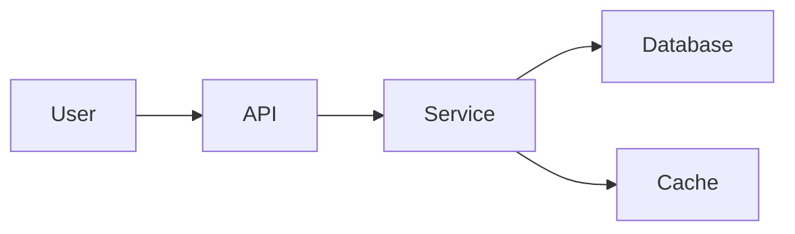
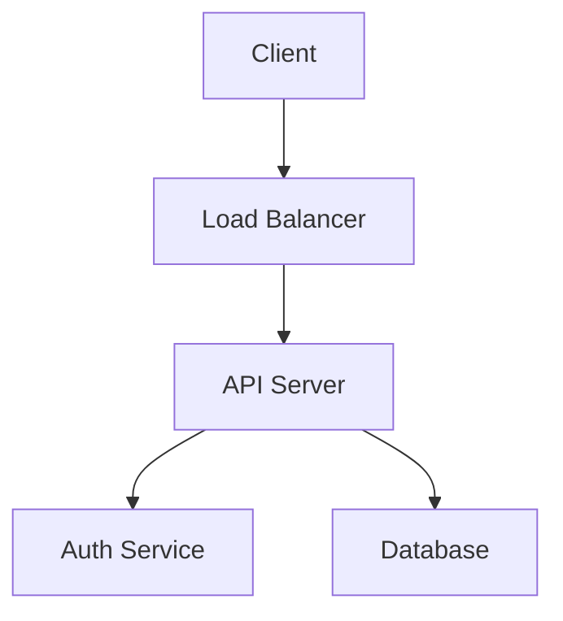

# Mermaid
[Readme.md](../README.md)


## 1️⃣ System Architechture Diagram

<pre>

&nbsp;```mermaid 
flowchart LR
    User --> API
    API --> Service
    Service --> Database
    Service --> Cache
&nbsp;```
</pre>



Use for:

- Microservices overview
- Backend architecture

## 2️⃣ Request Flow Diagram

<pre>&nbsp;```mermaid
 flowchart LR
    User --> API
    API --> Service
    Service --> Database
    Service --> Cache
&nbsp;```</pre>



Useful for explaining **how a request travels through the system**.

# 3️⃣ Microservices Architecture

<pre>&nbsp;```mermaid
flowchart LR
    User --> API
    API --> Service
    Service --> Database
    Service --> Cache
&nbsp;```</pre>

```mermaid
flowchart LR
    API[API Gateway]
    UserService
    OrderService
    PaymentService
    DB[(Database)]

    API --> UserService
    API --> OrderService
    OrderService --> PaymentService
    UserService --> DB
    OrderService --> DB

Great for **distributed systems**.

---

# 4️⃣ Sequence Diagram (API Interaction)

```markdown
```mermaid
sequenceDiagram
    User->>Frontend: Login
    Frontend->>API: POST /login
    API->>AuthService: Validate
    AuthService-->>API: Token
    API-->>Frontend: Success

Shows **step-by-step interactions between services**.

---

# 5️⃣ Database ER Diagram

```markdown
```mermaid
erDiagram
    USER ||--o{ ORDER : places
    ORDER ||--|{ PRODUCT : contains

    USER {
        int id
        string name
        string email
    }

    ORDER {
        int id
        date created_at
    }

    PRODUCT {
        int id
        string name
    }

Useful for **data modeling documentation**.

---

# 6️⃣ CI/CD Pipeline Diagram

```markdown
```mermaid
flowchart LR
    Dev --> Git
    Git --> CI[Build & Test]
    CI --> Docker
    Docker --> Deploy

Perfect for showing **DevOps workflow**.

---

# 7️⃣ State Machine Diagram

```markdown
```mermaid
stateDiagram-v2
    [*] --> Created
    Created --> Processing
    Processing --> Completed
    Processing --> Failed

Common for:
- Order lifecycle
- Workflow engines

---

# 8️⃣ Event Driven Architecture

```markdown
```mermaid
flowchart LR
    ServiceA --> Kafka
    Kafka --> ServiceB
    Kafka --> ServiceC

Shows **message queues / event streaming**.

---

# 9️⃣ Deployment Diagram

```markdown
```mermaid
flowchart TD
    Browser --> CDN
    CDN --> WebServer
    WebServer --> AppServer
    AppServer --> Database

Useful for **infra and hosting architecture**.

---

# 🔟 Git Branch Workflow

```markdown
```mermaid
gitGraph
   commit
   branch develop
   checkout develop
   commit
   branch feature
   checkout feature
   commit
   checkout develop
   merge feature

Perfect for explaining **team git workflow**.

---

# 💡 Pro Tip (for README documentation)

A good **project README architecture section** typically includes:

1. **System architecture diagram**
2. **Request flow**
3. **Database ER diagram**
4. **CI/CD pipeline**
5. **Deployment architecture**

These five diagrams alone make documentation **10× clearer**.

---

✅ If you'd like, I can also show you:

- **A complete README template for software projects (used by top GitHub repos)**  
- **15 Mermaid diagrams every backend developer should know**  
- **How to generate architecture diagrams automatically from code**.