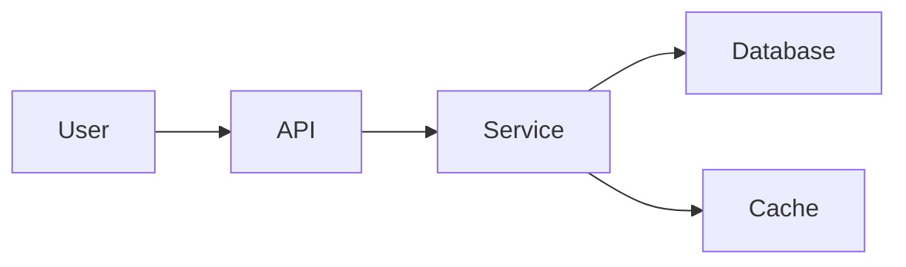

# Disciplined Agile and Value Stream

* By Joshua Barnes, Process Metors, Inc.

The Disciplined Agile and Value Streams video provides a foundation for beginning to understand what is required to accelerate value delivery at scale by moving beyond individual teams and applying Disciplined Agile across the organization. It gives an overview of the Disciplined Agile tool kit and compares team improvements to value stream improvements. This video is suitable for everyone. It serves as the required prerequisite for the Disciplined Agile Value Stream Consultant workshop.

Reference: [Link](https://www.projectmanagement.com/videos/866943/disciplined-agile-and-value-streams)

This is on-demand video overviews the Disciplined Agile tool kit and compares focusing on a team vs the value stream.

## Learning Objectives

* Explain What Disciplined Agile IS  
What prolem does DA solve?
* Describe the Elements of the DA Tool kit 
Mindset
* Recognize Lifecycle Options
Timebox | Kanban | Continuous Delivery
* Understanding the Disciplined Agile Browser
Online version of BOK
* Contrast Delivery Team focus vs Value Stream focus

## What problem does Disciplined Agile Solve?

* One Size Fits All - Problem: One prescriptive framework is not fit for all purposes.
  * Not all work is the same
    * My Team works on Enhancements
    * My Team works on MAarketing
    * My Team works on Innovation
    * My Team works on Maintenance
    * My Team works on Infrastructure Services
  * Problems
    * Doing things that don't add value
    * Frameworks that conflicts with our company culture
    * a

