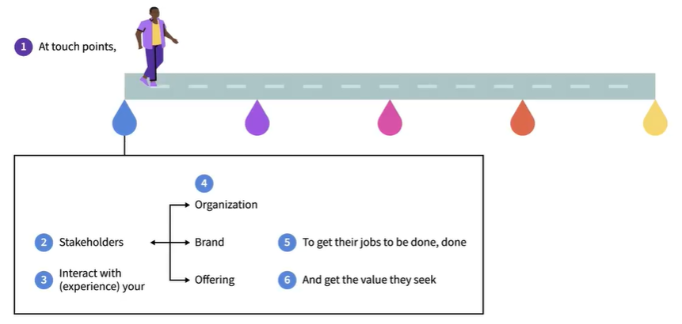
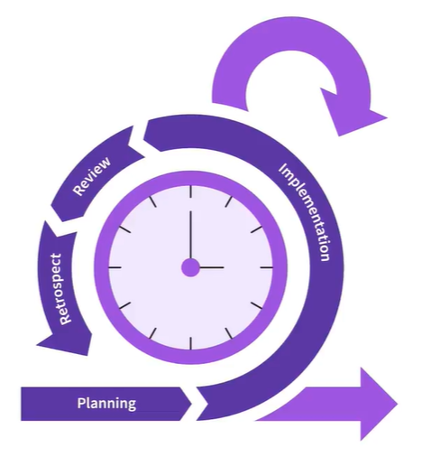
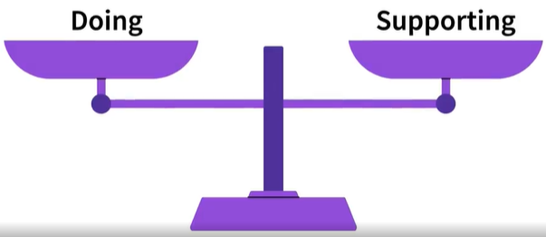

# 📘Agile Project Management - Continuous Improvement

## 1. Modern Work Environment (VUCA)

Today’s organizations operate in a VUCA environment:

* Volatile → rapid and unpredictable change
* Uncertain → lack of clarity about future
* Complex → many interconnected factors
* Ambiguous → unclear meaning of events

### 👉 Key takeaway: Stability is rare — adaptability is essential

## 2. What is Agile Continuous Improvement?

The ability to:

* Continuously observe changes
* Adapt quickly
* Improve processes, products, and behavior
* Goal: Stay a superior alternative in a changing environment

### 👉 In simple terms

> "Notice change → Adjust → Improve → Repeat"

## 3. Why It Matters

Necessary to:

* Survive in modern digital organizations
* Thrive and outperform others
* Without continuous improvement:
* Skills become outdated
* Organizations lose competitiveness

## 4. Core Capabilities to Develop

To succeed, individuals must build:

### ✅ Skills

* Observation of trends and changes
* Problem-solving and adaptation

### ✅ Knowledge

* Understanding environments and systems
* Awareness of opportunities and risks

### ✅ Mindset (most important)

* Openness to change
* Proactive improvement attitude
* Willingness to learn continuously

## 5. Role of Individuals in Organizations

Organizations need people who:

* Monitor what's changing
* Adjust strategies and actions
* Leverage opportunities
* Avoid risks/problems

### 👉 These people stand out as

* Strong contributors
* Future leaders

## 6. Key Message from David Pultorak

* Agile continuous improvement is not optional
* It is a critical survival skill
* You can differentiate yourself by mastering it

## 🧠 Quick Revision Summary

* VUCA world → constant change
* Agile continuous improvement → adapt + improve continuously
* Requires → skills + knowledge + mindset
* Outcome → survival + competitive advantage

---

## 📘 Agile Continuous Improvement — Revision Notes (Slide 2)

## 🔹 1. VUCA Context (Reinforcement)

* **Volatile** → rapid change  

* **Uncertain** → unpredictable future  
* **Complex** → many interdependencies  
* **Ambiguous** → unclear situations  

👉 Traditional approaches are becoming **obsolete** in this environment.

---

### 🔹 2. Core Survival Skill: Adaptability

* Adaptability = **lifeline in VUCA world**

* Enables you to:
  * Stay relevant  
  * Lead in uncertainty  
  * Respond to rapid change  

---

### 🔹 3. Agile Continuous Improvement Cycle

A continuous loop:

1. **Observe**
   * Identify what’s changing
   * Focus on what matters

2. **Reflect**
   * Understand meaning of changes
   * Evaluate impact

3. **Take Action**
   * Improve current work  
   * Stop ineffective practices  
   * Start new approaches  

👉 Simple loop:  
**Observe → Reflect → Act → Repeat**

---

### 🔹 4. Consumer-Centric Thinking

* Focus on:
  * What consumers (users/customers) are trying to achieve  
  * “Jobs to be done”  

* Goal:
  * Deliver **superior experience + value**

👉 Constantly ask:  
**“What problem is the user trying to solve?”**

---

### 🔹 5. Key Principle: Iterative Adjustment

* Work is adjusted through:
  * **Feedback-driven decisions**
  * **Short, time-boxed iterations**

👉 Not one big release → continuous small improvements

---

### 6. Breaking Down the Term

#### ✅ Agile

* Quickly:
  * Gather feedback  
  * Respond to environmental changes  

* Goal:
  * **Reduce time to value**

---

#### ✅ Continuous

* Happens:
  * Regularly  
  * In **time-boxed sprints**  

* Driven by:
  * Continuous feedback loop  

---

#### ✅ Improvement

* Not optional enhancement ❌  

* It is:
  * **Mandatory adaptation to change** ✅  

---

---

### 🔹 7. Value Concept

* **Value is time-bound**
  * Deliver value **early and continuously**

* Use:
  * **Minimum Viable Product (MVP)**
* Avoid:
  * Delayed perfection  

👉 Focus:  
**“Deliver now, improve later”**

---

### 🔹 8. Working Style in Agile

* Work in:
  * **Sprints (short iterations)**  

* Each sprint includes:
  * Feedback  
  * Adjustment  
  * Improvement  
---

---

### 🔹 9. Feedback Approach

Gather feedback:

* **Continuously (not occasionally)**  

* Improve:
  * **Daily or frequently**  
* Iterate:
  * Based on **latest insights**

---

### 🔹 10. Key Differences from Traditional Approach

| Traditional | Agile Continuous Improvement |
|------------|-----------------------------|
| Fixed plans | Adaptive approach |
| Late delivery | Early + incremental delivery |
| Big releases | Small iterative releases |
| Assumes stability | Assumes constant change |
| Less feedback | Continuous feedback |

---

### 🔹 11. Success Metrics

Ability to:

* Adapt to change  
* Deliver value incrementally  
* Improve continuously  

👉 Success ≠ perfection  
👉 Success = **responsiveness + value delivery**

---

### 🔹 12. Culture & Mindset

Promotes:

* Adaptability  
* Flexibility  
* Innovation  
* Resilience  
* Collaboration  
* Ownership  
* Psychological safety  

---

#### 🧠 Quick Revision Summary 2

> VUCA → constant change environment  

* Adaptability = survival skill  
* Loop → Observe → Reflect → Act  
* Focus → Consumer needs (jobs to be done)  
* Work style → Sprints + continuous feedback  
* Goal → Deliver value early & improve continuously  

---

---

## 📘 Agile Continuous Improvement — Revision Notes (Slide 3)

### 🔹 1. Core Idea: Balance Between Doing & Improving

* Work in organizations has two parts:

#### ✅ Doing

* Day-to-day operational work:
  * Build products  
  * Deliver services  
  * Support customers  
  * Run processes  

#### ✅ Improving the Doing* Enhancing how work is done:

* Increase efficiency  
* Improve quality  
* Remove inefficiencies  

👉 Key Insight:  

> **You must do BOTH — not just one**

---

### 🔹 2. The Covey Principle (Sharpen the Saw)

* Problem:
  * Focusing only on doing → performance degrades over time  * Solution:
  * Allocate time to **improve the way you work**

👉 Avoid:

* ❌ Constant busyness (doing only)  

👉 Aim for:

* ✅ Balance (doing + improving)

---

### 🔹 3. Role of Continuous Improvement in Agile Workflow

* Happens:
  * **Alongside daily work (not separately)**  * Scope:
  * Entire organization  
  * All teams and individuals  

👉 Every person must:

* Spend time doing  * Spend time improving how they do  

---

### 🔹 4. Practices Supporting Continuous Improvement

#### 🔸 Agile

* Iterative development  * Fast feedback loops  

#### 🔸 DevOps

* Continuous integration & delivery  * Automation + collaboration  

#### 🔸 Scrum

* Structured sprints  * Regular retrospectives (improvement points)  

👉 These practices enable:

>**Continuous delivery + continuous improvement**

---

### 🔹 5. “Continuous Everything” Concept

* Agile Continuous Improvement is part of:
  👉 **Continuous Everything**

Includes:

* Continuous feedback  * Continuous delivery  * Continuous learning  * Continuous improvement  

👉 Goal:* Constant evolution & adaptation

---

### 🔹 6. Lean Concepts (Foundation)

1. Identify Value* Define what is valuable to the customer  
1. Map the Value Stream* Visualize steps to deliver value  * Identify waste  
1. Create Flow* Ensure smooth, uninterrupted workflow  
1. Establish Pull* Work based on demand (not assumptions)  
1. Seek Perfection* Continuously improve processes  

> 👉 Lean + Agile = Continuous Improvement Engine

---

### 🔹 7. Key Objective* Not just efficiency ❌  * Primary goal:

> **Optimize consumer experience** ✅  

👉 Focus:
**Deliver the right value, at the right time, with quality**

---

## 🔹 8. Why Continuous Improvement is Critical

* Environment is constantly changing  
* Static processes quickly become outdated  

* Therefore: Improvement must be:
  * Continuous  
  * Iterative  
  * Built into daily work  

---

## 🔹 9. Culture & Execution

* Requires:
  * Time allocation for improvement  
  * Organization-wide adoption  
  * Continuous learning mindset  

👉 Improvement is:* Not a one-time activity  * A **core responsibility**

---

## Quick Revision Summary

* Work = Doing + Improving  
* Avoid “busy but not improving” trap  
* Continuous improvement runs alongside daily work  
* Enabled by: Agile, DevOps, Scrum  
* Based on Lean principles  
* Goal: maximize customer value & experience  
* Part of: Continuous Everything mindset  

---
