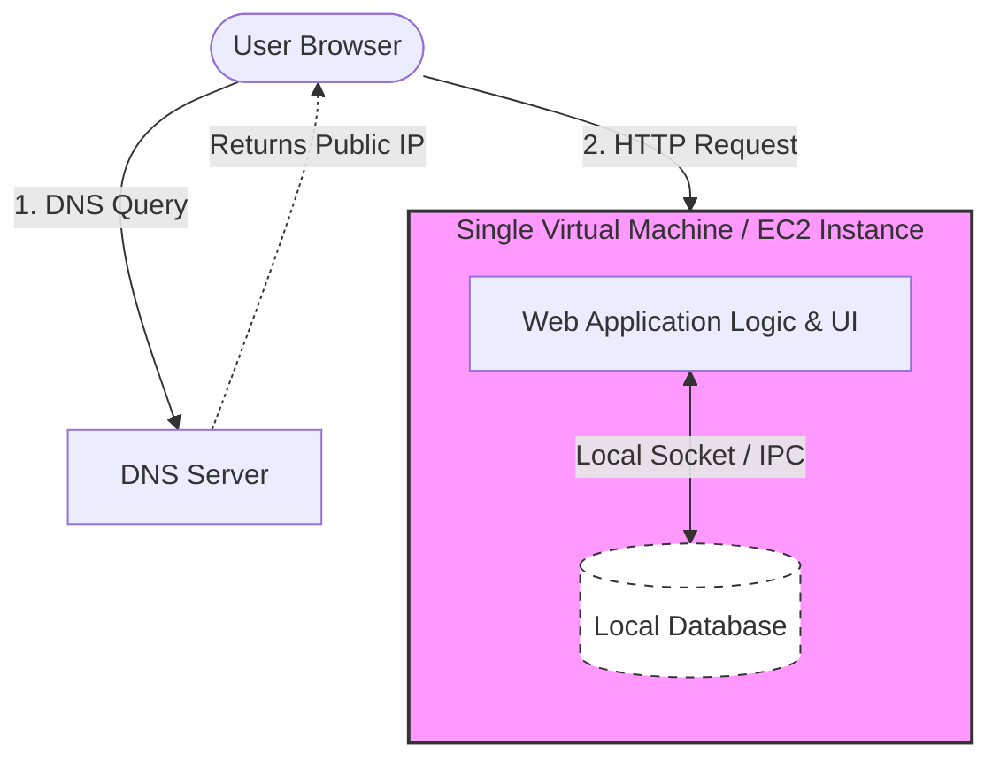

# System Design 

Resources:
* [System Design Videos by Piyush Garg](https://www.youtube.com/watch?v=lFeYU31TnQ8&list=PLinedj3B30sBlBWRox2V2tg9QJ2zr4M3o&index=1)

## **Comprehensive Evolution Plan: From Single VM to Global Scalability**

This study plan outlines the architectural journey of a web application. Each phase identifies specific bottlenecks and introduces design patterns or cloud-native services to resolve them.

---

### Phase 1: The Baseline – Monolithic Architecture on a Single VM

* **1.1. Single VM Deployment (App + DB)**
  * **1.1.1. Component Overview:** A single process running on one virtual machine (e.g., EC2) containing the application logic and the database.
  * **1.1.2. Networking:** Basic DNS resolution where a client points to a public IP registered in DNS.
  * **Diagram:** `[User Browser] -> [DNS] -> [Public IP] -> [EC2 Instance (Web App + SQL Database)]`
  * **Explanation:** This is the simplest starting point where all components share CPU and RAM. It is easy to develop but suffers from vertical scaling limits.
* **1.2. Identifying Initial Problems**
  * **1.2.1. Resource Exhaustion:** Increased traffic causes CPU/RAM contention between application logic and database queries.
  * **1.2.2. Single Point of Failure (SPOF):** If the VM crashes or hardware fails, the entire service and all data are unavailable.

---

### Phase 2: Infrastructure Decoupling and Managed Services

* **2.1. Separating Data and Static Assets**
  * **2.1.1. Managed Databases:** Shifting the database to a service like Amazon RDS to gain automated backups and "replatforming" benefits.
  * **2.1.2. Static Storage:** Offloading CSS, JavaScript, and images to Amazon S3 to reduce VM disk I/O and improve asset delivery.
  * **Diagram:** `[User] -> [EC2 App Server] -> [RDS Database]; [User] -> [S3 Bucket (Static Files)]`
  * **Explanation:** By moving data out of the VM, you ensure the application server can be replaced without data loss, utilizing purpose-built cloud persistence.
* **2.2. Problem: Traffic Bottlenecks**
  * **2.2.1. Scaling Limits:** A single VM cannot handle high volumes of concurrent requests (e.g., 100K+ transactions per second).
  * **2.2.2. Availability:** No automated mechanism exists to route traffic away from an unhealthy VM.

---

### Phase 3: Horizontal Scaling and Intelligent Routing

* **3.1. Introducing Load Balancing**
  * **3.1.1. Layer 4 vs. Layer 7:** Utilizing Network Load Balancers (L4) for fast, protocol-agnostic routing or Application Load Balancers (L7) for "application-aware" routing based on HTTP headers and paths.
  * **3.1.2. Auto Scaling Groups:** Automatically adding or removing EC2 instances based on performance metrics to handle traffic spikes.
  * **Diagram:** `[User] -> [ALB/NLB] -> [Auto Scaling Group of EC2s] -> [RDS]`
  * **Explanation:** The load balancer acts as a traffic cop. L7 balancers allow for advanced features like SSL termination and session persistence.
* **3.2. Problem: Frontend Performance and SEO**
  * **3.2.1. Client-Side Latency:** Large JavaScript bundles in Single-Page Applications (SPAs) slow down first-time users and impact SEO scores.
  * **3.2.2. Solution:** Implementing Server-Side Rendering (SSR) for faster "Time-to-First-Byte" (TTFB) or JAMstack for edge-delivered static content.

---

### Phase 4: Modernization via Microservices

* **4.1. Breaking the Monolith (Strangler Fig Pattern)**
  * **4.1.1. Incremental Migration:** Gradually extracting features from the legacy monolith into independent microservices or AWS Lambda functions.
  * **4.1.2. Anti-Corruption Layer (ACL):** Implementing a facade to translate legacy semantics to new microservice models, preventing breaking changes to the monolith.
  * **Diagram:** `[User] -> [API Gateway] -> (Route) -> [Legacy VM] OR [New Lambda Service]`
  * **Explanation:** Using an API Gateway as a centralized entry point abstracts backend complexity, providing routing, rate limiting, and authentication.
* **4.2. Problem: Security and API Complexity**
  * **4.2.1. Token Vulnerability:** Storing authentication tokens in the browser makes them vulnerable to XSS attacks.
  * **4.2.2. Solution:** Implementing the Backend for Frontend (BFF) pattern to manage tokens server-side and provide tailored APIs for different clients.

---

### Phase 5: Resiliency in Distributed Systems

* **5.1. Handling Service Failures**
  * **5.1.1. Circuit Breaker Pattern:** Preventing cascading failures by "tripping" connections to downstream services that exhibit high latency or repeated errors.
  * **5.1.2. Retry with Backoff:** Automatically retrying transient network errors with exponential wait times to avoid overwhelming services.
  * **Diagram:** `[Order Service] -> [Circuit Breaker (OPEN/CLOSED)] -> [Payment Service]`
  * **Explanation:** These patterns ensure that one failing microservice does not cause a "cascading timeout" that degrades the entire application.
* **5.2. Managing Distributed Data Consistency**
  * **5.2.1. Saga Patterns:** Using orchestration (via AWS Step Functions) or choreography (via EventBridge) to manage "local transactions" across multiple service databases.
  * **5.2.2. Transactional Outbox:** Ensuring atomicity between a database update and a message notification to solve the "dual write" problem.

---

### Phase 6: Global Scale and Event-Driven Architecture

* **6.1. High Availability and Disaster Recovery**
  * **6.1.1. DNS Best Practices:** Separating internal recursive and authoritative DNS layers to enable transparent failover.
  * **6.1.2. Global Server Load Balancing (GSLB):** Using "Smart DNS" to route global users to the nearest healthy regional data center.
  * **Diagram:** `[Global User] -> [GSLB/Route 53] -> [Region A ALB] OR [Region B ALB]`
  * **Explanation:** This provides multi-site resilience. If an entire region fails, traffic is seamlessly redirected to a secondary site.
* **6.2. Advanced Data Patterns**
  * **6.2.1. Event Sourcing:** Capturing every state change as an immutable event in a log (e.g., Kinesis) for point-in-time recovery and auditability.
  * **6.2.2. Publish-Subscribe (Pub-Sub):** Using message brokers (e.g., SNS) to decouple services, allowing them to scale independently through asynchronous communication.

---

## **Phase 1: The Baseline – Monolithic Architecture on a Single VM**

Phase 1 focuses on the simplest form of web deployment. While this approach is rarely suitable for modern production environments, it serves as the essential benchmark for understanding the bottlenecks that distributed cloud architectures are designed to solve.

---

### 1.1. Single VM Deployment (App + DB)

* **1.1.1. Component Overview:**
  * In this "traditional" monolithic model, the application runs as a **single process** or a tightly coupled set of processes.
    * Both the application logic (code) and the **data store** (database) reside on the same server or Virtual Machine (VM).
    * The application is typically developed such that most functionality is provided within this single container, leading to **tight coupling** between components.

* **1.1.2. Networking and DNS:**
  * **DNS Resolution:** A client's browser contacts a DNS server to resolve a domain (e.g., `www.example.com`) to a single **Public IP address**.
  * **Direct Interaction:** The user interacts directly with the server via that IP. There is no intermediary logic (like a load balancer) to inspect or route traffic.

**Diagram: The Phase 1 Monolith**

```text
       [ User Browser ]
              |
              | (1) DNS Query: "Where is example.com?"
              v
       [ DNS Server ] ----> Returns: 1.2.3.4 (Public IP)
              |
              | (2) HTTP Request to 1.2.3.4
              v
+------------------------------------------+
|          Virtual Machine (VM)            |
|       (e.g., AWS EC2 Instance)           |
|                                          |
|   +-------------------+                  |
|   |  Web Application  |                  |
|   |  (Logic & UI)     |                  |
|   +---------|---------+                  |
|             | (3) Local Disk/Socket IPC  |
|   +---------v---------+                  |
|   |     Database      |                  |
|   |  (SQL or NoSQL)   |                  |
|   +-------------------+                  |
+------------------------------------------+
```



*   **Explanation:** The diagram shows the user reaching the VM through a simple DNS-to-IP mapping. Inside the VM, the Web App and Database share the same memory, CPU, and disk. Communication between the app and DB happens locally (e.g., via a Unix socket or localhost IP), which is fast but creates severe resource contention.

---

#### **1.2. Identifying Initial Problems**

*   **1.2.1. Resource Exhaustion and Scaling Limits:**
    *   **Vertical Scaling Only:** To handle more traffic, you must "scale vertically" by adding more CPU or RAM to the single VM. 
    *   **Contention:** As traffic increases, the application logic and the database queries begin to fight for the same underlying hardware resources. High CPU usage by the app can slow down database indexing, and vice versa.

*   **1.2.2. Single Point of Failure (SPOF):**
    *   **Reliability Risk:** Because there is only one server, if the hardware fails, the VM crashes, or the operating system hangs, the entire service becomes unavailable.
    *   **Data Integrity:** If the VM’s disk fails, both the application and the database (including all user data) are lost unless a manual backup was recently offloaded.

*   **1.2.3. Development and Maintenance Friction:**
    *   **Regression Risk:** Because the code is tightly coupled, any change to a small feature requires retesting and redeploying the **entire application**.
    *   **Innovation Bottleneck:** Large monolithic codebases become "cognitive loads" for teams, making it harder to add new features without breaking existing ones.

---

#### **Phase 1 Summary Table**

| Feature | Phase 1 Status |
| :--- | :--- |
| **Scaling** | Vertical (Larger VM) |
| **Availability** | Low (SPOF) |
| **Complexity** | Low (Everything in one place) |
| **Data Storage** | Local to VM |
| **DNS** | Simple A-Record (Public IP) |
